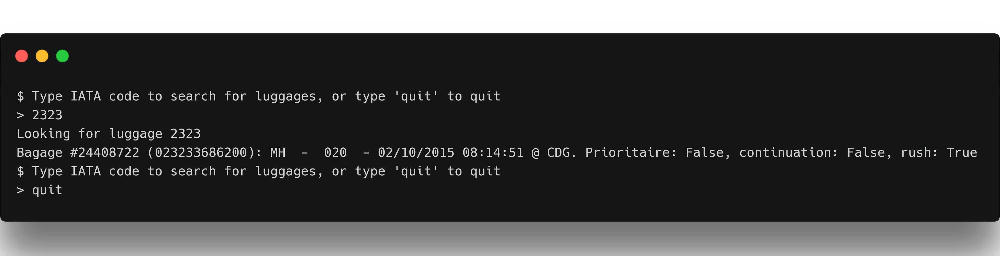
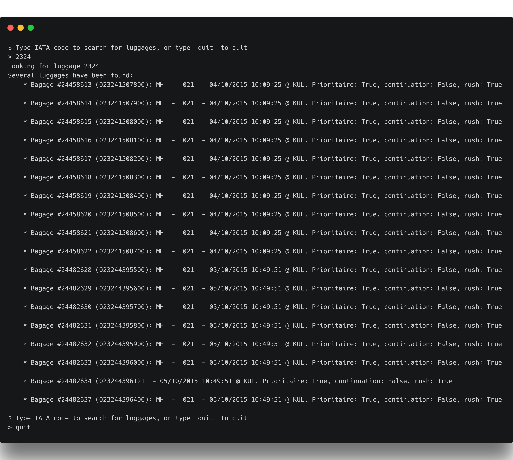
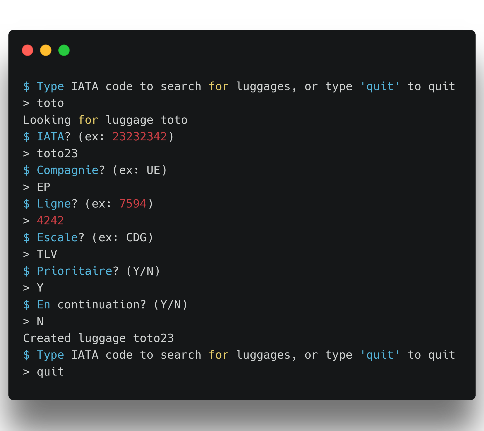
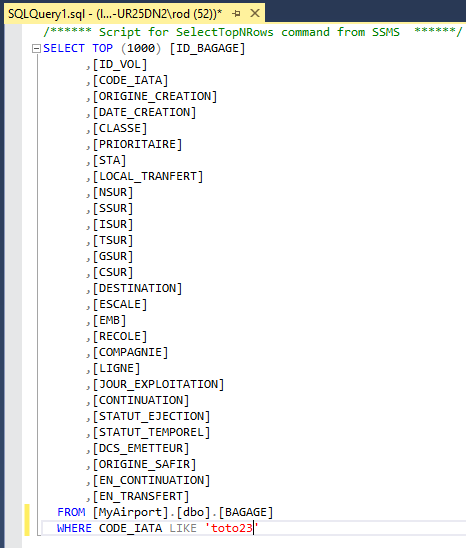
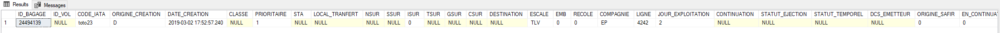

# Authors

* Tony CLONIER (tony.clonier)
* Rodolphe GUILLAUME (guilla_w)

# How to use

Nous avons fait le choix d'une interface en ligne de commande (CLI).
Nous étions parti sur un Windows Form, mais étant tous deux sous UNIX, il nous était difficile de continuer seuls dans cette direction.

La CLI permet de rechercher des bagages via leur code IATA, et d'en créer un dans le cas où la recherche ne renvoie aucun résultat.

## Recherche d'un bagage

Pour rechercher un bagage, il suffit de taper son code IATA. Il vous est alors retourné sous la forme d'une chaîne de caractères.

## Recherche de plusieurs bagages

La recherche d'une liste de bagages est similaire à la recherche d'un bagage unique.
Lorsqu'un code IATA correspond à plusieurs bagages, la liste de ceux-ci est affichée.

A noter également que la recherche s'effectue en regardant quels codes IATA ou morceaux de codes IATA correspondent à l'entrée de l'utilisateur.

> Par exemple, la recherche "42" pourrait correspondre aux codes IATA "42000000", "00420000" ou bien encore "00000042".

## Ajout d'un bagage

L'ajout d'un bagage s'enclenche lorsqu'une recherche ne donne aucun résultat.

L'utilisateur est alors invité à rentrer les informations concernant son bagage.

On peut alors vérifier l'insertion avec des visualisateurs de bases de données, comme SSMS.

Cependant, le bagage entré n'apparaît pas dans les recherches des utilisateurs.
Nous pensons que cela vient du fait que l'insertion dans la table BAGAGE n'est pas suffisante, et que des clés étrangères devraient être insérées dans d'autres tables.

